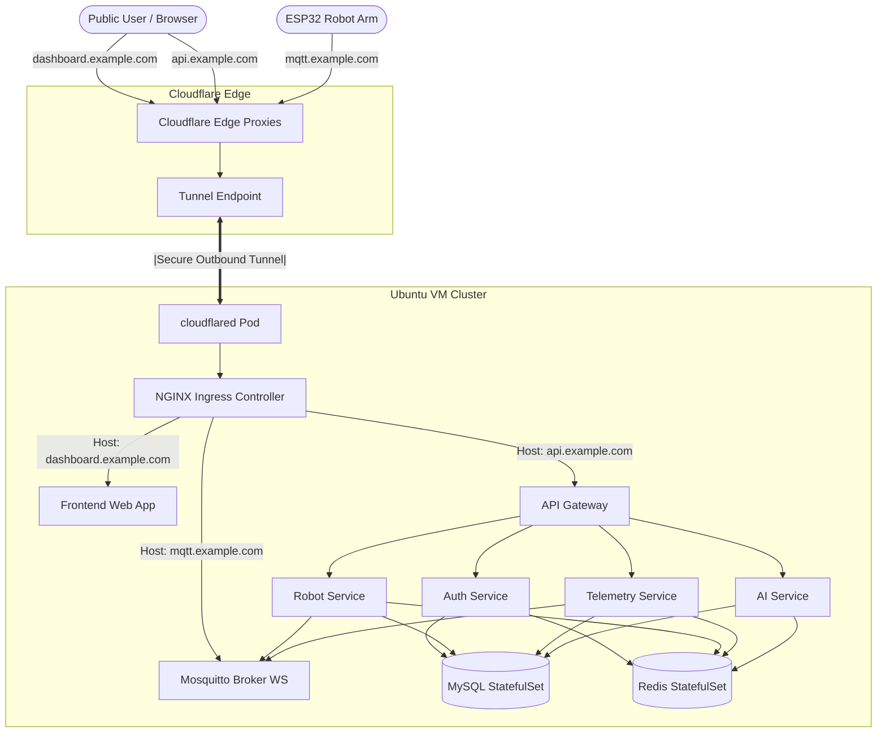

# ⚙️ Grabber DevOps & Infrastructure

> **Repository `11`** · Operations, deployment automation, monitoring, and security hub for the Grabber ecosystem. Configures a single-node k3s cluster hosted on an Ubuntu Server VM exposed via Cloudflare Tunnel, while preserving local development Compose blueprints.

[]()
[]()
[]()
[]()

---

## 🎥 Video Demonstration

<div align="center">
  <a href="https://www.youtube.com/watch?v=dQw4w9WgXcQ">
    
  </a>
  <br/>
  <sub>Click the image above to watch the demonstration video on YouTube.</sub>
</div>

---

## 🧭 System Ingress and Deployment Architecture

The production environment deploys to a single Ubuntu Server VM using k3s. No public inbound VM ports (e.g. 80, 443, 3306) are required. External connections route securely via an outbound Cloudflare Tunnel to the NGINX Ingress controller, which directs traffic to the frontend dashboard, microservices, messaging, or Grafana dashboards.



For a comprehensive explanation, see [docs/architecture.md](docs/architecture.md).

---

## 📦 Project Structure

```text
devops-infra/
├── README.md               # Main instructions and overview
├── Makefile                # Commanding interface
├── .gitignore              # Git ignore configuration
├── .env.example            # Environment configuration template
│
├── config/                 # Static configuration files
│   ├── repositories.env.example
│   ├── platform.env.example
│   └── domains.env.example
│
├── scripts/                # Task automation bash scripts
│   ├── bootstrap-vm.sh     # Prepare VM configurations
│   ├── install-tools.sh    # Install kubectl, helm, etc.
│   ├── install-k3s.sh      # Setup k3s cluster
│   ├── clone-all-repos.sh  # Clone app source files
│   ├── pull-all-repos.sh   # Safely sync apps
│   ├── create-secrets.sh   # Construct k8s secrets
│   ├── deploy-infrastructure.sh # Deploy databases, broker, ingress
│   ├── deploy-applications.sh   # Deploy microservices and ingress
│   ├── deploy-monitoring.sh     # Setup Prometheus and Grafana
│   ├── deploy-cloudflare.sh     # Setup Cloudflare Tunnel connector
│   ├── verify-deployment.sh     # Cluster health checking
│   ├── restart-platform.sh      # Rollout restart applications
│   ├── backup-mysql.sh          # Execute database dump
│   ├── restore-mysql.sh         # Load database dump
│   └── uninstall-platform.sh    # Platform cleanups
│
├── kubernetes/             # Main declarative manifests
│   ├── namespaces/         # Namespace specifications
│   ├── infrastructure/     # DB, cache, broker resources
│   ├── applications/       # App deployment configs
│   ├── ingress/            # NGINX Routing maps
│   └── security/           # Network isolation policies
│
├── helm/                   # Helm configurations values
│   ├── ingress-nginx-values.yaml
│   └── monitoring-values.yaml
│
├── cloudflare/             # Cloudflare Tunnel resources
│   ├── deployment.yaml
│   └── secret.example.yaml
│
├── monitoring/             # Alerts and dashboard definitions
│   ├── service-monitors/   # Custom ServiceMonitors
│   ├── alert-rules/        # Prometheus AlertRules
│   └── dashboards/         # Provisioning dashboards
│
├── backups/                # Local database dumps
│   └── .gitkeep
│
├── docker-compose/         # Legacy local dev stack (Preserved)
│   ├── docker-compose.yml
│   ├── jenkins/
│   └── databases/
│
└── docs/                   # Full documentation folders
    ├── architecture.md
    ├── vm-setup.md
    ├── deployment.md
    ├── cloudflare.md
    ├── monitoring.md
    ├── backup-restore.md
    └── troubleshooting.md
```

---

## ⚡ Quick Start

For detailed preparation steps, see [docs/vm-setup.md](docs/vm-setup.md) and [docs/deployment.md](docs/deployment.md).

```bash
# 1. Copy config templates and populate credentials
cp .env.example .env
cp config/repositories.env.example config/repositories.env
cp config/platform.env.example config/platform.env
cp config/domains.env.example config/domains.env

# 2. Bootstrap VM and install tools (kubectl, helm, k3s)
sudo make install

# 3. Clone microservices repositories
make clone

# 4. Generate cluster secrets
make secrets

# 5. Deploy all infrastructure and application components
make deploy

# 6. Verify rollout health
make verify
```

---

## 🛠️ Common Operations Interface

Manage your deployment using the root `Makefile` targets:

| Command | Action |
|---|---|
| `make status` | Check host nodes, platform pods, and system namespaces status. |
| `make logs` | Stream logs from all platform containers. |
| `make restart` | Perform a rolling rollout restart of the microservice deployments. |
| `make backup` | Trigger a MySQL backup dump into `backups/mysql/`. |
| `make restore BACKUP_FILE=<path>` | Restore MySQL databases from a valid SQL file with validation warnings. |
| `make uninstall` | Uninstall applications while preserving storage volumes. |
| `make uninstall MODE=delete-data` | Uninstall everything and wipe database persistent volumes (requires confirmation). |

For detailed debugging steps, see [docs/troubleshooting.md](docs/troubleshooting.md).

---

<div align="center">
  <sub>Part of the <strong>Grabber</strong> AI-Powered Industrial Robotic Arm Platform</sub>
</div>
