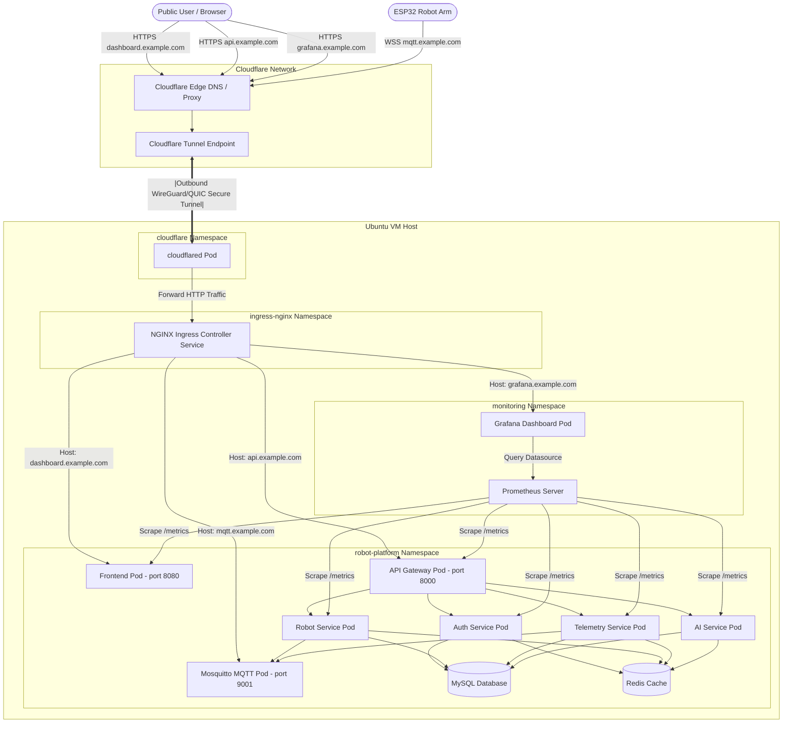

# Platform Architecture

This document describes the networking, deployment, and service orchestration architecture of the Grabber Platform on a single Ubuntu Server VM using k3s and Cloudflare Tunnel.

## Ingress Flow Architecture

All external traffic enters the platform via Cloudflare, is forwarded securely by an outbound-only Cloudflare Tunnel (`cloudflared`) to the internal NGINX Ingress Controller, and is then routed to the target services based on Host headers.

## Key Architectural Principles

1. **Zero Trust Exposure**: No host VM ports (such as 80, 443, 3306, 6379, 1883) need exposure to the public internet. The VM runs a secure UFW firewall blocking all incoming ports except SSH (TCP 22) for administration. Outbound-only tunnels established by `cloudflared` forward traffic from the Cloudflare Edge to the internal NGINX Ingress controller.
2. **Namespace Isolation**:
   - `robot-platform`: Runs application code and databases.
   - `ingress-nginx`: Hosts the NGINX ingress controller.
   - `cloudflare`: Dedicated namespace for the tunnel daemon.
   - `monitoring`: Contains Prometheus, Alertmanager, and Grafana.
3. **Internal-Only Databases**: MySQL, Redis, and raw MQTT (1883) do not have public ingresses or routes. They are restricted to ClusterIP services and are isolated via Kubernetes NetworkPolicies to prevent unauthorized lateral movement.
4. **WebSocket-Only Broker Connectivity**: The Mosquitto broker exposes WebSockets on port 9001, which is proxied through NGINX Ingress and Cloudflare Tunnel to support public robot telemetry streams. The standard TCP MQTT port (1883) remains internal-only.
